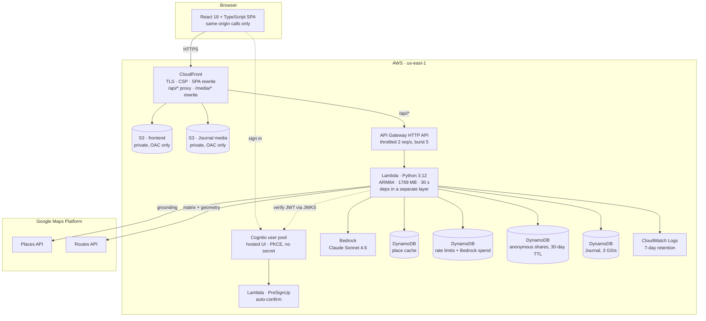

# Vialo

**Describe your day. Get one that actually fits.**

Live: **[vialo.place](https://vialo.place)** · no payment, nothing to install, and no account needed
to plan a day or read the [Journal](#vialo-journal).

Vialo is a constraint solver for one day in a city. It grounds suggested stops to real Google Place
IDs, interprets requested-date opening hours, computes a directed travel-time matrix, solves the
retained route exactly, and returns a scheduled timeline with an honest naive-versus-optimized
comparison. Google Maps is the final handoff, not the scheduling engine.

**Built with Kiro, spec-driven from the first commit, and running entirely on AWS.** Solo entry for
the Ready, Spec, Ship hackathon. How Kiro was used: [KIRO.md](KIRO.md) and
[`.kiro/`](.kiro/). Day-by-day record, including what went wrong: [DEVLOG.md](DEVLOG.md).

## How it runs on AWS

Every part of Vialo that is not Google Maps data is AWS. One Lambda serves the whole API, four
DynamoDB tables hold cache, limits, shares, and the Journal, Bedrock does candidate selection, and
Cognito is the only identity provider.



Everything above is defined in [`infra/template.yaml`](infra/template.yaml) as one AWS SAM stack with
explicit least-privilege IAM. Nothing is clicked together by hand. Both buckets are private and
reachable only through CloudFront with Origin Access Control, Bedrock is called through the Lambda
execution role rather than an API key, and the request pipeline itself is in
[Architecture](#architecture) below.

## Why it exists

On a train to Napoli with one day to spend, we burned the morning planning it by hand: ask a chatbot
what to see, search each place individually, paste them into Google Maps one at a time, then drag the
stops around trying to find an order that didn't zigzag across the city. We got a route. It cost us
the part of the day we were trying to save. And we still arrived somewhere closed.

Any chatbot can emit a Google Maps link — that was tested and confirmed before this project started.
The link is trivial. Making its *contents* correct is not, and there are three things a language
model structurally cannot do:

1. **Ground the places.** Model-generated coordinates are confident, well-formed, and wrong by
   50–300 metres. Every Vialo stop resolves to a real `place_id`: real door, real address, real photo.
2. **Optimize the order.** A model guesses a plausible sequence. Vialo measures a directed
   travel-time matrix with the Routes API and solves the ordering exhaustively — provably shortest at
   the product cap, not plausible-looking.
3. **Make the day fit.** Bounded visit estimates plus real opening hours plus real travel times
   produce a schedule that either works or is explicitly diagnosed. Stops that cannot fit appear in a
   "couldn't fit" section with a reason, instead of a broken day presented as a good one.

## What it does

- **Prompt → grounded, scheduled itinerary.** Up to 9 verified stops, arrival and departure times,
  travel legs, waits caused by opening times, and dropped-stop diagnostics.
- **Exact route optimization with a visible comparison.** Two real route geometries, drawn over the
  same bounds: the candidate order versus the solved order, with the measured difference stated.
- **Timeline and map.** Place-local wall times, `opens 09:30` annotations, attributed Places photos,
  category-aware markers that never rely on color alone, and accessible fullscreen maps.
- **Google Maps handoff and anonymous sharing.** An ordered place-ID URL plus browser-safe parts, and
  `vialo.place/r/<id>` permalinks that expire after 30 days.
- **Vialo Journal.** Travellers publish what a day was actually like, optionally attaching the
  itinerary Vialo computed for them, and those stories surface again when someone else plans a day in
  the same city. See [Vialo Journal](#vialo-journal).

Everything a judge sees is computed at request time. There is no fixture fallback and no hard-coded
itinerary anywhere in the production path.

## Architecture

```
prompt ─▶ scope guard ─▶ Bedrock Claude ─▶ Places grounding ─▶ computeRouteMatrix
         (zero spend)    (typed output)    (place_id, hours,    (directed 10×10)
                                            timezone, photos)
                                                                      │
     Maps handoff ◀── 2× computeRoutes ◀── exact solver with time windows
     (ordered IDs)     (real polylines)     (≤9! permutations, progressive dropping)
```

1. **Candidate selection.** Claude Sonnet 4.6 on Bedrock returns Pydantic-validated candidates —
   name, category, priority, bounded visit estimate. Places is never used for discovery; it is
   expensive, slow, and worse than the model at "what is worth seeing". No model prose is ever
   rendered.
2. **Grounding.** Each candidate resolves to `place_id`, coordinates, `timeZone.id`, requested-date
   opening hours, rating, and attributed photos, cached in DynamoDB as separately expiring profile,
   regular-hours, and date-specific-hours items. Hours are never invented: a stop with none published
   is kept only with visible `unverified` provenance, and an explicit closure is an exclusion.
3. **Directed matrix.** One `computeRouteMatrix` call over origin plus stops. The matrix is never
   mirrored — a validated fixture returned 518 s one way and 508 s the other for the same 592 m pair.
4. **Exact solving.** Every permutation is simulated forward against travel time, opening intervals,
   required waits, and the user's window, with deterministic tie-breaks. Infeasible days drop the
   least essential stop and re-solve, with a stated reason per drop.
5. **Real comparison and handoff.** Two ordered `computeRoutes` calls produce the naive and optimized
   polylines and metrics. If either fails, both lines are omitted and the comparison is reported
   unavailable rather than drawn as straight segments.

**Why brute force rather than a heuristic.** At the 9-stop product cap the search is 362,880 bounded
arithmetic checks, and the result is provably optimal instead of approximate. That claim is only worth
making with measurements, so `scripts/solver_benchmark.py` runs the production solver in a real ARM64
Lambda. Worst case is an infeasible nine-stop day, where the search reruns after each progressive drop:

| Environment | 8 stops, worst case | 9 stops, worst case |
|---|---:|---:|
| Lambda ARM64 512 MB | 1.34 s | 11.98 s |
| Lambda ARM64 1024 MB | 0.64 s | 5.76 s |
| Lambda ARM64 1769 MB | 0.40 s | 3.53 s |

The deployed function runs at 1769 MB (one full vCPU) for that reason, keeping a full nine-stop day
inside the 30-second API Gateway budget without giving up exactness. Raw results:
[`docs/kiro-evidence/solver-benchmark/`](docs/kiro-evidence/solver-benchmark/).

## Vialo Journal

The second surface of Vialo, live at **[vialo.place/journal](https://vialo.place/journal)**. The
engine answers "what should my day look like". The Journal answers "what was this day actually like
for the person who walked it".

**Reading needs no account.** Stories, comments, attached routes, and the city filter are all open.
An account is required only to publish, comment, or report.

**Try it without signing up.** A demo account is published deliberately so a judge can post
immediately:

| | |
|---|---|
| Email | `demo@vialo.place` |
| Password | `VialoJudge2026` |

This is a throwaway account on a rate-limited free service. It is not a credential leak, it is a
front door. Normal sign-up works too, and is auto-confirmed so there is no emailed code to wait for.

**What a story is.** A title, a city, 50 to 8000 characters of plain text, one optional cover image,
and one optional itinerary. Publish from a computed day with "Publish this day as a story" and the
full response is snapshotted into the post, so the route survives long after the 30-day share window
closes. It renders read-only inside the story using the same component that renders a share, so there
is exactly one itinerary renderer in the product.

**How the two halves connect.** When a computed day resolves to a city that has published stories,
the result view surfaces up to three of them. That is the piece that makes the Journal and the engine
one product rather than two tabs sharing a domain. It renders nothing when the city is empty or the
Journal is unreachable, so a Journal outage can never degrade a working itinerary.

**Identity holds as little as possible.** AWS Cognito is the only identity provider, using
Authorization Code with PKCE and no client secret. The backend verifies every write against the
pool's published JWKS. Your email address stays inside the user pool: the Journal table stores an
opaque subject and a display name, and nothing else about you. Tokens are never logged.

**Abuse limits, all server-side.** Five stories and twenty comments per account per day, bodies
bounded at 8000 characters, comments at 500, request bodies refused above 64 KB, and a story hidden
from the whole site once three accounts report it. Ownership failures return `404` rather than `403`,
so the API never confirms that someone else's story exists.

**Cover images.** One per story, 2 MB, JPEG, PNG, or WebP, uploaded straight from the browser to a
private bucket with a presigned POST. A POST rather than a PUT because only POST can carry the size
cap and the exact content type as signed policy conditions, which puts S3 rather than the browser in
charge of enforcing them. Keys are server-generated under the author's opaque subject, so choosing a
path or overwriting someone else's image is impossible by construction.

**User text is never markup.** Stored bodies are plain text with control characters stripped and
whitespace collapsed, and the frontend renders them through JSX text interpolation only. There is no
`dangerouslySetInnerHTML` anywhere in the Journal.

Specification: [`.kiro/specs/journal/`](.kiro/specs/journal/). It is the one spec in this repository
written after its implementation rather than before, which is recorded in [KIRO.md](KIRO.md) rather
than smoothed over.

### Known gaps

Stated here rather than discovered during judging:

- The Cognito hosted sign-in page is branded to the Vialo palette through
  [`infra/cognito-hosted-ui.css`](infra/cognito-hosted-ui.css), applied with
  `scripts/apply-cognito-branding.sh`. Cognito accepts only a fixed allowlist of classes and
  properties there, so it is close to the product rather than identical to it, and its stylesheet
  has to be updated by hand whenever a colour token changes.
- EXIF metadata, including GPS, is not stripped from uploaded cover images.
- Moderation is mechanical. Three reports hide a story, with no appeal and no human review.
- Sign-up is auto-confirmed, so email addresses are unverified. Abuse is bounded by the daily
  allowances rather than by identity.
- Stories cannot be edited after publication. The only correction is deletion.

## How Kiro was used

[**KIRO.md**](KIRO.md) is the full account. In short: this project was spec-driven from the first
commit, and the commit order shows it — `.gitignore`, then steering, then recorded provider fixtures,
then requirements/design/tasks, then code.

- [`.kiro/steering/`](.kiro/steering/) — four always-loaded files carrying product scope, the
  pipeline, security rules, repository conventions, and the design system.
- [`.kiro/specs/itinerary-engine/`](.kiro/specs/itinerary-engine/) — 13 requirements, a technical
  design that justifies exhaustive search, and 21 tasks in 6 waves that map onto the shipped modules.
- [`.kiro/agents/`](.kiro/agents/) — a `ui-reviewer` with the pinned Playwright MCP server bound in
  its config, and a `backend-engineer` restricted to backend paths.
- [`.kiro/hooks/`](.kiro/hooks/) — repository credential/ignore validation after every write, plus
  frontend and backend gate hooks that must pass before a turn can end.
- [`.kiro/skills/`](.kiro/skills/) — five progressively loaded review skills.
- [`docs/kiro-evidence/`](docs/kiro-evidence/) — hook transcripts, the secret scan, the fresh-clone
  gate, the guardrail battery, and the solver benchmark. Every artifact names the command that
  regenerates it.

KIRO.md also lists fifteen corrections, including a design that specified the wrong language, a
9×9 matrix that should have been 10×10, a model that emitted the wrong JSON key, and a memory setting
that the benchmark proved was too small.

## Frontend

Mobile-first React 18 + TypeScript SPA built with Vite: natural-language input, factual pipeline
loading state, honest route comparison, one Google Maps overlay, complete
arrival/travel/wait/departure timeline, dropped-stop diagnostics, Maps handoff, and explicit
anonymous sharing. Shared permalinks are read-only; only the creating browser receives a separate
deletion capability, stored in local storage.

The browser calls only same-origin `/api/*` routes through CloudFront. It validates the typed
response at runtime, and a committed JSON Schema plus a backend drift test keeps the TypeScript
contract synchronized with the authoritative Pydantic model.

Journal routes are `/journal` (hero, city filter, card grid), `/journal/p/:postId` (story, attached
route, comments), `/journal/new` (editor), `/journal/me` (own stories and remaining allowance), and
`/auth/callback` (PKCE code exchange). The Cognito domain and application client ID are compiled into
the bundle: they are public client configuration, not credentials, because the client has no secret
and its redirect URI is pinned in the user pool.

## Backend

One Python 3.12 Lambda behind API Gateway HTTP API: strict Pydantic contracts, Lambda Powertools,
direct Google Places and Routes REST adapters (unified `GOOGLE_SERVER_KEY`), a provider-neutral
candidate-selector boundary with AWS Bedrock Claude Sonnet 4.6 in production, and four on-demand
DynamoDB tables for place cache, rate limits (including Bedrock spend tracking), explicit anonymous
shares, and the Journal.

The same function serves the Journal routes under `/api/blog/*`, but the two features share nothing
except the process: separate configuration loaders, separate tables, separate failure modes. A
missing Journal variable cannot stop a planning request, and a missing Google key cannot stop a story
from loading.

Guardrails, all server-side: a zero-spend scope guard that refuses non-itinerary prompts before any
paid call, a 500-character input cap, five accepted planning requests per IP per hour keyed by an HMAC
of the address (never the address itself), and API Gateway throttling at 2 req/s with burst 5.

Bedrock inference is budget-capped by a fail-closed DynamoDB spend limiter that reserves conservative
maximum micro-USD before each call and refunds unused reservations after confirmed usage. The monthly
cap defaults to $5 via `BEDROCK_MONTHLY_BUDGET_USD`. This is application-level metering — synchronous,
conservative (worst-case `max_output_tokens` at $4/M input, $20/M output), and distinct from AWS
Budgets, which evaluates delayed billing data and cannot stop a single request from overshooting.
Botocore retries are disabled (`total_max_attempts: 1`) so one reservation maps to exactly one wire
call, and missing or malformed usage retains the full reservation.

Third-party packages are built separately into an ARM64 Lambda layer; the function artifact contains
only `vialo` application code.

## Local validation

Prerequisites: Python 3.12, `uv`, Node.js/npm, AWS CLI, and network access for the pinned SAM CLI tool.

```bash
# Backend and infrastructure
uv sync --project backend --extra dev
make test
make lint
make typecheck
make layer
make validate
make build

# Frontend
cd frontend
npm ci
npm run generate:contracts
npm run lint
npm run typecheck
npm test
VITE_GOOGLE_MAPS_BROWSER_KEY=replace-with-referrer-restricted-key npm run build
```

The release gate passes 553 backend tests and 197 frontend tests, strict mypy and TypeScript, Ruff and
ESLint, source and transformed SAM validation, an ARM64 layer check, a production Vite build, and
`npm audit` with zero known vulnerabilities. Ordinary tests mock provider and AWS boundaries and make
no live provider calls. The fresh-clone transcript in
[`docs/kiro-evidence/fresh-clone.txt`](docs/kiro-evidence/fresh-clone.txt) records the same commands
passing on a clean checkout, at the earlier commit `acffec1` where the counts were 455 and 116; the
Journal added the rest.

Two optional verification harnesses are committed:

```bash
uv run --project backend python scripts/scope_guard_battery.py          # 33 adversarial prompts, zero spend
uv run --project backend python scripts/solver_benchmark.py --stops 8 9 # exact-solver timings
```

## Configuration

Copy `.env.example` to a local ignored file and replace placeholders. Google and HMAC secrets are
server-side only. Bedrock access uses the Lambda execution IAM role — no API key or secret — scoped to
`bedrock:InvokeModel` on the specific inference-profile ARN and its three backing foundation-model
ARNs (us-east-1, us-east-2, us-west-2).

The Google Maps browser key is separate and visible in the browser bundle by design. Restrict it to
`https://vialo.place/*` (plus explicitly approved local origins) and enable only the Maps JavaScript
API. The two `VITE_COGNITO_*` values are also in the bundle by design and are not credentials: the
Cognito app client has no secret, and its redirect URI is pinned in the user pool, so neither value
authorizes anything on its own. Never place Bedrock credentials, Google server keys, or HMAC secrets
in frontend code. A full gitleaks scan of the entire commit history reports no leaks
([`docs/kiro-evidence/secret-scan.txt`](docs/kiro-evidence/secret-scan.txt)).

## Deployment

`infra/template.yaml` defines the deployed `vialo-backend-dev` stack in `us-east-1`: ARM64 Lambda at
1769 MB with a 30-second timeout, HTTP API with default throttling, explicit least-privilege IAM, two
seven-day log groups, four PAY_PER_REQUEST DynamoDB tables, a TLS 1.2 REGIONAL API domain, a
private encrypted S3 frontend bucket, and CloudFront with Origin Access Control. CloudFront owns
frontend TLS, applies CSP and security headers, rewrites extensionless SPA routes without masking
`/api/*` or asset failures, and proxies uncached same-origin API requests.

The Journal adds a Cognito user pool, application client, and hosted-UI domain, a `PreSignUp`
auto-confirm function, a private media bucket reachable only through CloudFront at `/media/*`, and a
CloudFront Function that maps those paths to bucket keys. The Content-Security-Policy was widened by
exactly one entry, the Cognito token endpoint, and no more. Execution-role permissions are scoped to
the Journal table, its three indexes, and the media prefix.

The production site is live at `https://vialo.place`, with `/api/*` proxied same-origin through
CloudFront and `https://api.vialo.place` available as the direct API hostname. Live Playwright
verification confirmed the branded responsive experience at 360/390/1440 px, progressive pipeline
state, Maps presentation, typed errors, keyboard navigation, reduced motion, security headers, private
S3 enforcement, anonymous share create/read/delete, and a real itinerary computed from a Tbilisi
prompt — resolving the intended Sports Palace at May Square, rolling a date-less elapsed 09:00 window
to the next local day, scheduling verified stops with ratings and attributed photos, and displaying
real naive-versus-optimized route evidence.

## Future

Deliberately out of scope for this build, kept here instead of in the product:

- Multi-day itineraries and public transit as a travel mode.
- More than 9 stops, which would require replacing exhaustive search with a bounded heuristic.
- Saved trips and collaborative editing.
- Live re-planning while walking, and offline caching of a computed day.
- Journal editing, threaded replies, follows, notifications, and author profile pages.
- Server-side image re-encoding to strip EXIF metadata from Journal cover images.

## Attributions

- Maps, places, hours, and routes: **Google Maps Platform** (Places API New, Routes API, Maps
  JavaScript API). Map controls and Google attribution stay visible and unobscured, and every
  displayed Places photo keeps its returned author attribution as a linked credit.
- Typefaces: **Inter** and **Newsreader**, both under the SIL Open Font License 1.1, self-hosted via
  pinned Fontsource packages that include the license metadata. Production makes no third-party font
  request.
- Model inference: **AWS Bedrock**, Claude Sonnet 4.6.

See [`KIRO.md`](KIRO.md), [`DEVLOG.md`](DEVLOG.md), [`frontend/README.md`](frontend/README.md), and
[`.kiro/specs/itinerary-engine/`](.kiro/specs/itinerary-engine/) for the workflow, day-by-day
decisions, invariants, and acceptance criteria.

## License

[MIT](LICENSE)
